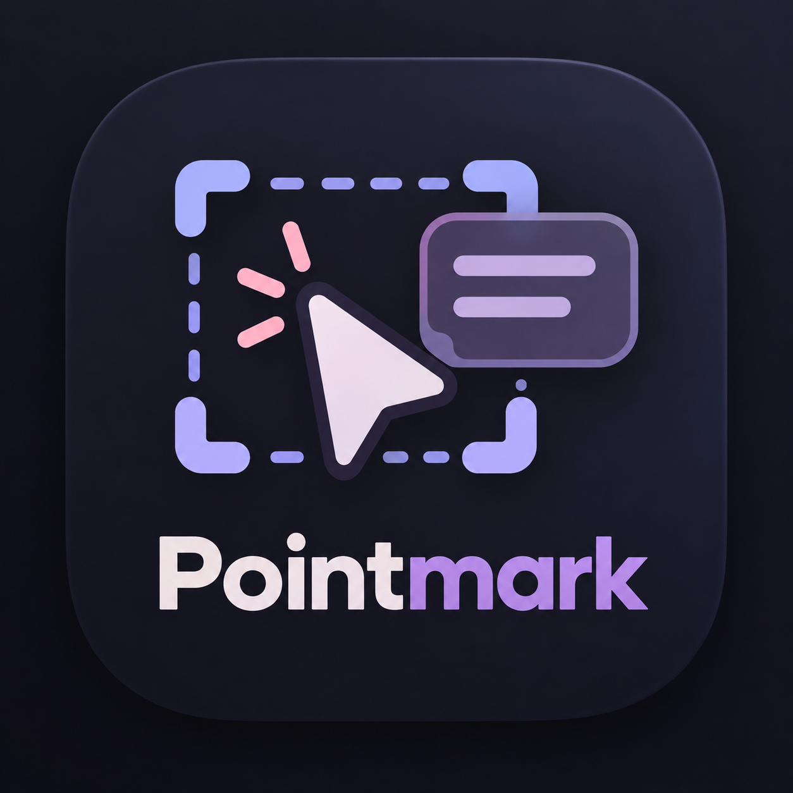

# Pointmark



Pointmark is a browser add-on for Chrome. It helps you tell an AI assistant what to change on a web page.

Click a part of a page, type what you want changed, then copy a short description. Paste that text into ChatGPT, Claude, Cursor, or any other AI chat.

Everything stays in your browser. Nothing is uploaded.

## What it does

- **Pick any element** — press `Alt+A`, then click the part of the page you mean.
- **Write what should change** — for example "make this button full width".
- **Choose how much detail to copy** — Short or Detailed.
- **Keep a list** — tick the notes you want, copy one, copy the ticked ones, or copy all.
- **See your notes on the page** — saved elements get a numbered marker.
- **Works offline by design** — up to 100 notes, saved in your browser only.

## Install

Pointmark is not in the Chrome Web Store, so you install it by hand. It takes about two minutes.

1. Open the [Releases](../../releases) page and download the newest `pointmark-vX.Y.Z.zip`.
2. Unzip it into a folder you will keep. Chrome reads the add-on from that folder, so do not delete or move it.
3. Open `chrome://extensions` in your browser.
4. Turn on **Developer mode** (top right corner).
5. Click **Load unpacked** and choose the folder from step 2. That button just means "install the folder I downloaded".
6. Click the puzzle-piece icon in the toolbar and pin **Pointmark**.
7. Open any website and press `Alt+A`.

More help, updating, and common problems: [docs/install.md](docs/install.md).

> Pointmark does not update itself. To get a new version, download the new zip, replace the files in the same folder, then click **Reload** on the `chrome://extensions` page. Your saved notes stay.

## How to use it

1. Press `Alt+A`. The mouse turns into a picker, and elements get outlined as you move.
2. Click the element you want to talk about. A small box opens next to it.
3. Type what should change, pick Short or Detailed, then click **Add** or **Copy**.
   - **Add** saves the note and lets you keep picking.
   - **Copy** copies just this one note and does not save it.
4. Click the Pointmark icon in the toolbar to see all your notes. You can tick rows, copy one row, copy the ticked rows, copy everything, delete a row, or clear the list.

A longer walkthrough: [docs/usage.md](docs/usage.md).

### Short or Detailed?

| What gets copied | Short | Detailed |
|---|---|---|
| Page address | yes | yes |
| The code that points to the element | yes | yes |
| Type of element and its visible text | yes | yes |
| The element's HTML | yes | yes |
| Its parent HTML (shortened) | yes | yes |
| Your instruction | yes | yes |
| Surrounding elements | no | yes |
| Nearest heading | no | yes |
| Styles in use | no | yes |
| Size and position on the page | no | yes |
| Page title | no | yes |
| Another way to find the element | no | yes |

Use **Short** when naming the element is enough. Use **Detailed** for layout, spacing, or color requests.

### What the copied text looks like

Clicking Copy puts a text block on your clipboard. It looks like this:

````md
## Web Element Annotation

Page: https://example.com/pricing

Selector: `main > section:nth-of-type(2) > button.cta`

Tag: `button`

Text: `Start free trial`

HTML:

```html
<button class="cta" type="button">Start free trial</button>
```

Instruction:

Make this button full width on mobile.
````

When you copy more than one note, they arrive together in one block, one after another.

## Permissions — why Pointmark asks for them

| What it asks for | Why it is needed |
|---|---|
| `activeTab` | Lets the toolbar button talk to the page you are on |
| `storage` | Keeps your saved notes in your browser |
| `commands` | Registers the `Alt+A` shortcut |
| Access to pages you visit | Draws the outline, the small box, the markers, and the list on the page |

Pointmark sends nothing anywhere. There is no tracking and no internet request.

## For developers

```sh
npm install
npm run dev      # rebuilds dist/ while you work
npm run build    # checks the code and builds dist/
```

Then install the `dist/` folder the same way as step 5 above.

After changing `public/manifest.json` or `public/background.js`, run `npm run build` again and click **Reload** on the `chrome://extensions` page.

## For the project owner: making a release

1. Write what changed in [CHANGELOG.md](CHANGELOG.md). That text becomes the release notes, so keep it short and clear.
2. Raise the version number in `public/manifest.json` and `package.json` (use the same number in both).
3. Commit, then add a tag and push it: `git tag v0.1.1 && git push origin main v0.1.1`.
4. An automatic GitHub workflow builds the add-on, zips it, and publishes a release with the zip attached.

Version numbers work as `major.minor.patch` ([Semantic Versioning](https://semver.org/)). Every change users can see gets a [CHANGELOG](CHANGELOG.md) line.
